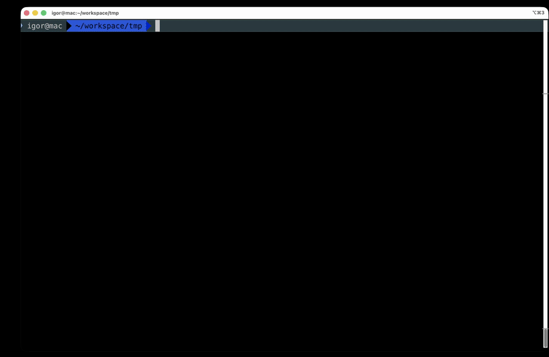

# clip-idle

`clip_idle.py` removes visually idle agent-waiting spans from Codex/Claude screen recordings.

It does not use OCR. It samples frames with `ffmpeg`, measures normalized visual difference between consecutive frames, finds long low-motion spans that are bracketed by activity, and writes a cleaned video plus a JSON manifest.

## Demo / Example


Command: `python3 clip_idle.py onput.mkv -o demo_output.gif --aggressiveness 3 --format gif --gif-width 920 --gif-fps 5`

Output video: 
<p align="center">
  
  <sub>
    Original file size: 11.2 MB, mkf format, output: 3.4MB, loop gif format 
    </sub>
</p>

## Usage

```bash
python3 clip_idle.py recording.mp4
```

This writes:

- `recording.cleaned.mp4`
- `recording.cleaned.mp4.manifest.json`

Preview detected cuts without creating a video:

```bash
python3 clip_idle.py recording.mkv --dry-run
```

Create a GIF instead:

```bash
python3 clip_idle.py recording.mkv --format gif
```

GIF output loops forever by default and uses a palette optimized for the cleaned clip. The default `960px` width at `12 FPS` is intended for terminal recordings embedded in GitHub README files:

```bash
python3 clip_idle.py recording.mkv --format gif
```

For sharper output, raise the width or use `--gif-width 0` to keep the source width. For smaller files, lower the width or frame rate.

You can also infer the format from the output suffix:

```bash
python3 clip_idle.py recording.mkv -o share.gif
```

Tune detection:

```bash
python3 clip_idle.py recording.mp4 --preset codex --min-duration 2 --threshold 0.003 --padding 0.2
```

Clip more aggressively with one multiplier:

```bash
python3 clip_idle.py recording.mp4 --aggressiveness 2
```

Useful options:

- `--preset codex|claude|generic`: default detection settings.
- `--format mp4|gif`: output format. Defaults to `mp4`, or `gif` when `--output` ends in `.gif`.
- `--gif-width`: GIF output width in pixels. Defaults to `960`; use `0` to keep the source width.
- `--gif-fps`: GIF frame rate. Defaults to `12`.
- `--aggressiveness`: multiplier for clipping strength. `1.0` preserves the preset/custom settings; higher values cut more by raising `--threshold`, lowering `--min-duration`, and widening `--padding`.
- `--threshold`: lower values are stricter and cut fewer spans.
- `--min-duration`: minimum quiet span length before it can be removed. The `codex` and `claude` presets default to `1.0` so short waits are cut.
- `--padding`: expands cuts slightly to hide transition flicker. The `codex` and `claude` presets default to `0.1`.
- `--crop full|center|terminal`: restricts the diff region.
- `--dry-run`: writes only the manifest.

MP4 output keeps the original resolution and uses a high-quality H.264 encode. GIF output has no audio and is limited by GIF's 256-color format, so MP4 will usually look better for screen recordings. Smaller MP4 files mainly come from cutting more idle time; use a separate compression pass if you need a specific target size.

## Requirements

- Python 3.11+
- `ffmpeg`
- `ffprobe`

## Tests

```bash
python3 -m unittest discover -s tests
```
